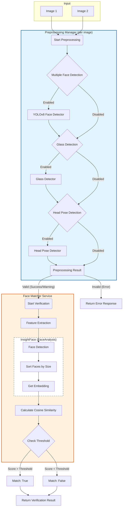
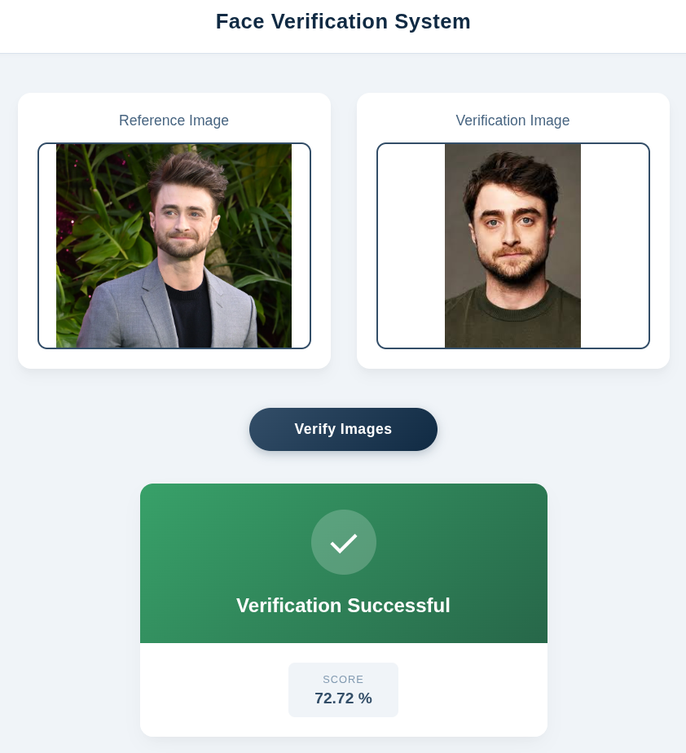

# 🎭 Face Verification Backend

> A robust, high-performance face verification system powered by **InsightFace** and **FastAPI**.


## 📖 Overview

This project delivers a secure, efficient, and production-ready backend for face verification. It leverages InsightFace, a state-of-the-art face recognition framework, to achieve high-accuracy identity matching.

The system incorporates a configurable and extensible preprocessing pipeline designed to ensure optimal input quality prior to verification. These preprocessing steps include detection and handling of multiple faces, eyeglasses presence, and head pose alignment. Each component can be independently enabled or disabled based on deployment requirements, allowing flexibility without compromising performance or reliability.

### ✨ Key Features

-   **High-Accuracy Verification**: Uses Cosine Similarity on face embeddings.
-   **Advanced Preprocessing**:
    -   🕵️ **Multiple Face Detection**: Ensures only one person is in the frame.
    -   👓 **Glass Detection**: Warns or handles users wearing glasses.
    -   🔄 **Head Pose Detection**: Validates if the user is looking straight at the camera.
-   **Fast & Async**: Built on FastAPI for high performance.

---

## 🧠 Core Logic Architecture

The following diagram illustrates the data flow and logic of the verification process:



---

## 🚀 Getting Started

### Prerequisites

-   **Python 3.10** is required.
    -   [Download Python 3.10](https://www.python.org/downloads/release/python-31019/)

### 📦 Installation

1.  **Clone the repository**
    ```bash
    git clone https://github.com/SharminNusrat/Face-Verification.git
    cd Face-Verification
    ```

2.  **Create a Virtual Environment**
    ```bash
    python3.10 -m venv venv
    source venv/bin/activate  # On Windows: venv\Scripts\activate
    ```

3.  **Install Dependencies**
    ```bash
    pip install -r requirements.txt
    ```
    N.B. You might fall into OSError 28 on some linux systems `
    solution:
    mkdir ~/pip-tmp
    export TMPDIR=~/pip-tmp

### ⚙️ Configuration

Copy the example environment file and configure it:

```bash
cp .env.sample .env
```

**Environment Variables:**

| Variable | Description | Default |
| :--- | :--- | :--- |
| `DEVICE` | Computation device (`cpu` or `cuda`) | `cpu` |
| `ENABLE_MULTIPLE_FACE_DETECTION` | Enable check for multiple faces | `True` |
| `ENABLE_FACE_GLASS_DETECTION` | Enable check for glasses | `True` |
| `ENABLE_HEAD_POSE_DETECTION` | Enable check for head orientation | `True` |
| `MODEL_NAME` | InsightFace model to use | `buffalo_l` |

---

## 🏃 Usage

Start the development server using Uvicorn:

```bash
uvicorn app.main:app --reload
```

The server will start at `http://127.0.0.1:8000`.

### 📡 API Endpoints

#### `POST /api/v1/face/verify`

Compares two face images and returns a verification score.

**Request:** `multipart/form-data`
-   `image1`: (File) First image.
-   `image2`: (File) Second image.

**Response:**
```json
{
  "match": true,
  "score": 0.85,
  "threshold": 0.5
}
```

---

## Input & Output

- 
- 

- 
