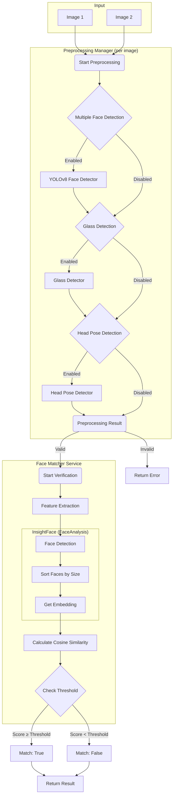

# 🎭 Face Verification Backend

> A **robust, high-performance face verification backend** built with **FastAPI** and powered by **InsightFace**.


---

## 📖 Overview

This project provides a **secure and production-ready backend** for face verification using **InsightFace**, one of the most accurate open-source face recognition frameworks.

The system is designed with a **modular preprocessing pipeline** to ensure high-quality inputs before verification. Each preprocessing step is configurable and can be independently enabled or disabled based on deployment requirements.

The backend is optimized for **accuracy, extensibility, and performance**, making it suitable for real-world identity verification systems.

---

## ✨ Key Features

* **High-Accuracy Face Verification**

  * Cosine similarity on deep face embeddings
* **Advanced Preprocessing Pipeline**

  * 🕵️ **Multiple Face Detection** — rejects images with more than one face
  * 👓 **Glasses Detection** — warns or restricts users wearing glasses
  * 🔄 **Head Pose Detection** — ensures the face is frontal
* **Configurable & Modular**

  * Enable/disable each preprocessing step via environment variables
* **Fast & Asynchronous**

  * Built with FastAPI for high-performance inference

---

## 🧠 System Architecture

### High-Level Flow

1. Each image is passed through the **Preprocessing Manager**
2. Images that pass validation are forwarded to the **Face Matcher**
3. InsightFace extracts embeddings and computes similarity
4. A final decision is made based on a configurable threshold

### Core Logic Diagram



---

## 🚀 Getting Started

### Prerequisites

* **Python 3.10**

  * Required for InsightFace compatibility
  * 👉 [https://www.python.org/downloads/release/python-31019/](https://www.python.org/downloads/release/python-31019/)

---

## 📦 Installation

### 1. Clone the Repository

```bash
git clone https://github.com/SharminNusrat/Face-Verification.git
cd Face-Verification
```

### 2. Create & Activate Virtual Environment

```bash
python3.10 -m venv venv
source venv/bin/activate
```

*(Windows: `venv\Scripts\activate`)*

### 3. Install Dependencies

```bash
pip install -r requirements.txt
```

---

### ⚠️ Linux Fix: `OSError [Errno 28] No space left on device`

On some Linux systems, `pip` may fail due to limited `/tmp` space.

**Solution:**

```bash
mkdir -p ~/pip-tmp
export TMPDIR=~/pip-tmp
pip install -r requirements.txt
```

---

## ⚙️ Configuration

Create your environment file:

```bash
cp .env.sample .env
```

### Environment Variables

| Variable                         | Description                         | Default     |
| -------------------------------- | ----------------------------------- | ----------- |
| `DEVICE`                         | Computation device (`cpu` / `cuda`) | `cpu`       |
| `ENABLE_MULTIPLE_FACE_DETECTION` | Reject multiple faces               | `True`      |
| `ENABLE_FACE_GLASS_DETECTION`    | Detect glasses                      | `True`      |
| `ENABLE_HEAD_POSE_DETECTION`     | Detect head pose                    | `True`      |
| `MODEL_NAME`                     | InsightFace model                   | `buffalo_l` |

---

## 🏃 Running the Server

```bash
uvicorn app.main:app --reload
```

Server will be available at:

```
http://127.0.0.1:8000
```

---

## 📡 API Reference

### `POST /api/v1/face/verify`

Verify whether two images belong to the same person.

#### Request

* **Content-Type:** `multipart/form-data`
* **Parameters:**

  * `image1` — First face image
  * `image2` — Second face image

#### Response

```json
{
  "match": true,
  "score": 0.85,
  "threshold": 0.5
}
```

---

## 🖼️ Example Input & Output

<p>
  
</p>

---

## 🧩 Tech Stack

* **Backend:** FastAPI
* **Face Recognition:** InsightFace
* **Language:** Python 3.10
* **Server:** Uvicorn

---

## 📌 Notes

* Designed for **single-face verification**
* Preprocessing steps are **fully optional and configurable**
* Optimized for **accuracy > raw speed**
* Suitable for **KYC, onboarding, and identity verification systems**

